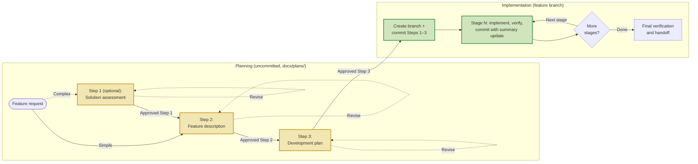
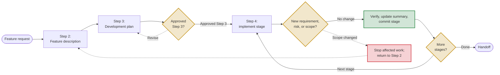

# Feature Development Process (FDP)

FDP is a file-based, approval-gated workflow for keeping AI-assisted feature work scoped, reviewable, and verified.

Use it with Claude Code, GitHub Copilot, or Codex when a feature needs a decision record and deliberate review points—not just a plausible patch.

## Why use this?
- Keeps multi-step feature work inside the model context window by splitting guidance across files.
- Forces approvals between steps so the assistant cannot sprint ahead without human review.
- Encourages reuse of shared UI/API components instead of letting the AI fork markup or payloads.
- Limits plan bloat so every deliverable stays within a page and can be reviewed quickly.

If you frequently see Claude/Codex derail because requirements evolve mid-stream, treat this repo as the “rails” that keep both you and the assistant honest.

## Quick start

The supported installation is a Git submodule at `docs/fdp`. FDP deliberately has no bootstrap script: before FDP is installed, use the visible Git commands below rather than executing downloaded code in the consuming repository.

From the **root of a clean, non-bare Git working tree**, run these read-only checks first. Stop if a check does not have the stated result; do not clean, reset, stash, remove, or overwrite anything to make it pass.

```bash
# Both commands must print the same absolute path.
git rev-parse --show-toplevel
pwd -P

# Must print "false".
git rev-parse --is-bare-repository

# Must print nothing. This includes staged, unstaged, and untracked files.
git status --porcelain

# Must exit successfully; docs/fdp must not exist, including as a symlink.
test ! -e docs/fdp && test ! -L docs/fdp
```

When all checks pass, add FDP. This command writes `.gitmodules`, stages the new submodule entry, and creates `docs/fdp`; it does not create a commit.

```bash
git submodule add --branch master https://github.com/gulkily/fdp.git docs/fdp
git status --short
git diff --cached -- .gitmodules docs/fdp
```

Inspect the displayed changes, then commit them through your normal repository workflow. Do not continue if the output shows files beyond `.gitmodules` and `docs/fdp`.

In your project, create `docs/plans/` if it does not exist. Then send your supported assistant this first prompt (adapt the story, but keep the explicit step request):

> As a user, I would like to export my saved searches as CSV, please write Step 1 of `@fdp`.

If the decision is straightforward, you may skip Step 1 and ask for Step 2 instead. Review each artifact before continuing. For example:

> Approved Step 1, please continue to Step 2.

After `Approved Step 3`, the assistant creates a feature branch, commits the approved planning documents first, then makes a separate commit—with the matching Step 4 summary update—for every completed stage. See the [worked example](./examples/private-window-lobby-fallback.md), [prompt fixtures](./examples/fixtures/), and [failure-mode guide](./docs/failure-modes.md).

The first run should take only a few minutes: read the four-step overview, send the prompt, and inspect the resulting Step 1 artifact. Do not approve a step you have not reviewed.

## Repo layout
- `FEATURE_DEVELOPMENT_PROCESS.md` – one-page overview of the entire chain plus key rules and warning signs.
- `docs/dev/feature_process/` – canonical instructions for each step. The assistant reprints these every time it advances.
  - `step1_solution_assessment.md`
  - `step2_feature_description.md`
  - `step3_development_plan_before.md`, `step3_development_plan_do.md`, `step3_development_plan_after.md`
  - `step4_implementation_before.md`, `step4_implementation_do.md`, `step4_implementation_after.md`
  - `step3_development_plan.md`, `step4_implementation.md` (compatibility entrypoints)
- `docs/plans/` (create per feature) – where you store the working artifacts: `{feature}_stepN_*.md` plus any auxiliary research. Move large efforts into `docs/plans/{feature}/` and update a local README for navigation.

## Reusing across projects

When cloning a project that already includes FDP, initialize its submodules with either command:
```bash
git clone --recurse-submodules <project-repository-url>
git submodule update --init --recursive
```

To update FDP, start from the consuming repository root only after the same clean-host check above passes. The submodule must also be initialized, clean, on `master`, and configured for the expected origin and branch. Each command below is either an inspection or operates only inside `docs/fdp`; the final merge refuses non-fast-forward history.

```bash
# Every inspection must match its comment.
git status --porcelain                         # no output
git -C docs/fdp status --porcelain             # no output
git -C docs/fdp branch --show-current          # master
git config --file .gitmodules --get submodule.docs/fdp.url       # https://github.com/gulkily/fdp.git
git config --file .gitmodules --get submodule.docs/fdp.branch    # master
git -C docs/fdp remote get-url origin          # https://github.com/gulkily/fdp.git

git -C docs/fdp fetch origin master
git -C docs/fdp merge --ff-only FETCH_HEAD
git diff --submodule=log -- docs/fdp
git status --short
```

Review the resulting `docs/fdp` pointer change, then commit it through your normal repository workflow. Neither workflow creates a consuming-repository commit.

If `docs/fdp` is uninitialized, run `git submodule update --init -- docs/fdp` and restart the checks. If a path is occupied, a repository is dirty, the checkout is detached, configuration differs, or the fast-forward merge refuses to proceed, stop and inspect that state; do not use `reset`, `clean`, `stash`, or deletion commands as a recovery shortcut.

## Examples

See [FDP Examples](./examples/) for three completed v3 feature cycles: a concise security-and-recovery case, a medium-complexity operational command, and a recovery-oriented offline-reading deep dive. Each example links to its Step 1–4 source artifacts and stage commits.

## How to run the chain with your AI pair
1. Kick things off with a plain request like `As a user, I would like to <story>, please write Step 1 of FEATURE_DEVELOPMENT_PROCESS.md.` Make the story explicit so the assistant starts from the user’s perspective.
2. Let the assistant draft the artifact in `docs/plans/`, then review/edit it directly or issue follow-up instructions until you’re satisfied.
3. When the doc hits the bar, reply verbatim with `Approved Step N, please continue to Step N+1.` The bot must stop until that phrase arrives, so you control scope creep.
4. Repeat the review/approval loop for each step. Keep Step 1-3 planning docs uncommitted through drafting/review.
5. After `Approved Step 3`, create the Step 4 feature branch and make the first commit with only the approved Step 1-3 docs.
6. During Step 4, make at least one stage-scoped commit per completed stage, and include that stage's Step 4 summary update in the same commit.

The strict per-step files mean you always paste a small, targeted instruction block into the chat; no more scrolling through a 4k-token mega-brief.

## Workflow at a glance

**Approval chain: each planning step needs explicit approval before the next begins.**



The plan artifacts live in the consuming repository’s `docs/plans/`; the FDP instruction files can remain under `docs/fdp/`. Approval gates stop forward progress. The feature branch begins only after Step 3, with a planning-doc commit; every Step 4 stage then gets its own auditable commit.

**Returning to planning: a scope change during Step 4 sends work back to Step 2.**



Returning to planning is a feature, not a failure: a new requirement or unresolved risk changes the approved boundary, so it must be reviewed before implementation resumes.

## Documentation checks

Run these before sharing an FDP change. The link check validates local Markdown paths; review rendered Mermaid diagrams on GitHub after publication because GitHub owns the renderer.

```bash
# Python 2.7+ or Python 3 (recommended; no third-party packages)
python scripts/check-markdown-links.py

# Perl (core modules only)
perl scripts/check-markdown-links.pl

# Node.js remains an optional equivalent
node scripts/check-markdown-links.mjs
git diff --check
git status --short
```

## What each step enforces
| Step | Goal | Key outputs |
| --- | --- | --- |
| Step 1 – Solution Assessment (optional) | Resolve ambiguity across competing approaches. | Original query (mechanically corrected only), plus a brief labeled understood-intent note when needed, then a ≤1-page pros/cons doc ending with a recommendation. |
| Step 2 – Feature Description | Nail down problem context, user stories, requirements, shared components, and success criteria. | `{feature}_step2_feature_description.md` |
| Step 3 – Development Plan | Break work into atomic stages with dependencies, verification notes, and component touchpoints. Prefer `## Stage N` headers plus flat bullets for each stage field. | `{feature}_step3_development_plan.md` |
| Step 4 – Implementation | Execute the approved artifact sequentially on a feature branch, logging applicable verification in a Step 4 summary. The artifact may be application changes or explicitly scoped documentation-only work. Prefer `## Stage N - title` headers plus bullets for changes, verification, and notes. | `{feature}_step4_implementation_summary.md` |

Each step/phase file lists guardrails plus "Next" instructions so the model always knows when to stop.

Every Step 1–4 artifact begins with a relative-link bar to the others, keeping the feature record navigable in GitHub.

## Tips for stubborn assistants
- **Reprint instructions**: before starting a step/phase, force the assistant to paste the relevant `docs/dev/feature_process/stepX...` file back to you. This keeps both sides aligned and provides an audit trail.
- **Call out risks early**: Step 2 records impact, early validation, and mitigation; Step 3 gates dependents on unresolved risks.
- **Shared component inventory**: Step 2 explicitly asks which canonical UI/API bits already exist. Reuse them; duplication is the fastest way models drift.
- **Finish a feature, not a layer**: Each cycle has a normal entry point, end-to-end outcome, and required recovery. Component-only work is internal maintenance.
- **Proportional verification**: Step 4 records verification appropriate to the approved artifact. Documentation-only work still requires document-integrity, evidence, link/path, and allowed-file-scope checks, but runtime, UI, deployment, migration, and release checks are not required unless the approved documents make a claim that needs them.
- **Documentation-only cycles**: Declare this work type and its allowed documentation file scope in Step 2, retain it in Step 3's Completion Contract, and do not alter application source, tests, CI, deployment configuration, or generated artifacts without returning for approval.

## Extending the process
- Need a domain-specific checklist? Fork one of the step files, add the extra bullets, and point your assistant to the customized version.
- Supporting artifacts (mockups, DB diagrams) belong beside the step docs in `docs/plans/{feature}/`. Reference them inside the deliverables but keep the main files concise.
- When a feature exceeds eight stages, start a new Step 2/3 cycle; each must remain a usable vertical slice.

## Getting help
Because every instruction lives in plain Markdown, you can diff tweaks, annotate lines for your assistant, or even inline reminders like “STOP after this file.” When in doubt, start from `FEATURE_DEVELOPMENT_PROCESS.md` and follow the breadcrumbs.
