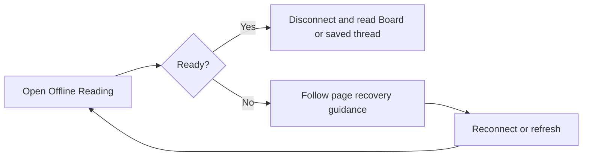

# Offline Reading Health Check

## Outcome

`/offline/` became a clear readiness and recovery page while normal Board and saved-thread URLs remained readable from a bounded public snapshot when offline. The cycle separated diagnostics from reading, preserved the public-data boundary, and gave readers and operators actionable recovery information.

## The Feature Cycle

| FDP step | Decision or result | Why it matters |
| --- | --- | --- |
| 1 — Solution assessment | Separate the health page from the offline reader shell. | A diagnostic page can explain readiness without turning the reader into a failure surface. |
| 2 — Feature description | Report device and published-snapshot health, preserve normal offline reading, and keep the snapshot public-only. | Readers receive a useful answer while private deployments retain their intended boundary. |
| 3 — Development plan | Sequence route separation, health reporting, cache transition, regression coverage, and operational recovery guidance. | Routing, browser cache behavior, privacy, and recovery are addressed as one vertical feature. |
| 4 — Implementation summary | Five stages delivered the health page, offline-reader fallback, cache update, automated coverage, and runbook. | The evidence covers both a prepared browser and a disconnected reader journey. |

## Recovery Path

The health page distinguishes local readiness from an online published-snapshot check. When offline, it does not claim that a network check occurred. On approved-members-only deployments, offline public snapshots remain intentionally unavailable rather than creating a bypass.

## Verification

- Focused route and offline-reader checks reported **3 passed**.
- The broader route, snapshot, and application checks reported **110 run, 105 passed**; the five failures were existing activity/signature failures, not offline-health assertions.
- An isolated release and browser profile were prepared online, verified ready, then used after the server stopped to open the normal Board from the offline reader with its offline-mode indicator.

## Audit Trail

- Read the original [Step 1–4 artifacts and stage commits](./SOURCES.md#offline-reading-health-check).
- The source cycle completed in [Stage 1](https://github.com/gulkily/v3/commit/26d615b4ca02d60127d8b58c71dc3ce96fdbaefb), [Stage 2](https://github.com/gulkily/v3/commit/126d11b895f4e6c9f187fa3bc7202ae0f7753ce3), [Stage 3](https://github.com/gulkily/v3/commit/707f892e4042bc2d1983ce7191cc49c0db81265b), [Stage 4](https://github.com/gulkily/v3/commit/0a6e143c7fb442db92e8881a7ab4556eaefa9a12), and [Stage 5](https://github.com/gulkily/v3/commit/02b6d4f34cc65451c4fb24c703d60c87cf087bf0).
