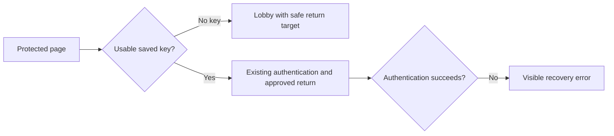

# Private Window Lobby Fallback

## Outcome

A visitor opening a protected page without a usable saved browser key now reaches Lobby—the permitted entry surface—while an approved member with a usable key still recovers to the requested page. Authentication and key-validation failures remain visible rather than being treated as a missing key.

## The Feature Cycle

| FDP step | Decision or result | Why it matters |
| --- | --- | --- |
| 1 — Solution assessment | Extend the absent-key outcome in the existing recovery client. | It preserves the existing server access gate and avoids a second anonymous entry surface. |
| 2 — Feature description | Keep the safe requested destination; distinguish absent keys from malformed keys and authentication failures. | The new path helps a genuine first-time/private-window visitor without hiding a real recovery problem. |
| 3 — Development plan | First route only the absent-key result to Lobby, then add regression coverage for keyless and saved-key flows. | The delivery order protects the security and recovery boundary before expanding test coverage. |
| 4 — Implementation summary | The recovery view is replaced with Lobby for an absent key, and focused coverage protects the behavior. | The final record captures both the user outcome and the evidence behind it. |

## Recovery Boundary

This is deliberately not a blanket unauthenticated redirect. Only an absent usable key enters Lobby; an invalid key, authentication failure, or network failure remains a visible recovery error.

## Verification

- A browser-context smoke check used a protected return target with no saved key. It made no authentication request and replaced the recovery view with Lobby while retaining the encoded return target.
- The focused private-site authentication and Lobby-route suite reported **8 tests passed**, covering missing-key Lobby entry, approved-key return, visible authentication failure, and private Lobby routing.

## Audit Trail

- Use the [artifact trail](./private-window-lobby-fallback-artifact-trail.md) to replay the cycle from its recorded request, prompts, plans, and stage commits.
- Read the original [Step 1–4 artifacts and stage commits](./SOURCES.md#private-window-lobby-fallback).
- The source cycle completed in [Stage 1](https://github.com/gulkily/v3/commit/e07c5fd3e2dd4692e60bff25436c2762bbf6290d) and [Stage 2](https://github.com/gulkily/v3/commit/e0455270c38236c9e3a0c0298548b29bedef8170).
